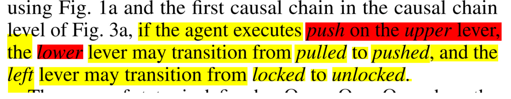
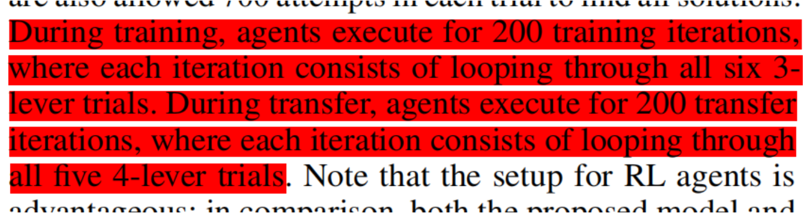

<<<<<<< HEAD
# 四个核桃大作业

🐮🐮🐮🐮🐮🐮


## 1. 环境配置 :wrench:  

先安装包
```bash
pip install -r requirements.txt
pip install openlockenv-0.0.4-py3-none-any.whl
```

卸载包
```bash
pip uninstall openlockenv
```

```python
import gymnasium as gym
import openlockenv #不加会报错

# 不支持render
# pattern: CC3,CC4,CE3,CE4
# max_steps: default 3, 包括开门最多动3次
# size: default 7 ,7 个 lever ,一闪门
# seed: default 0
max_step = 5
env = gym.make(id='openlockenv/OpenlockEnv-v0',pattern='CC3',seed=1,max_step=max_step)
#observation, info = env.reset()
#solution = info['solution'] # the solution of the environment
#print(solution)
episode = 10
for e in range(episode):
    print("------" + str(e)+"------")
    observation, info = env.reset()
    solution = info['solution']  # the solution of the environment
    print(solution)
    episode_over = False
    i = 0
    while(not episode_over):
        action = env.action_space.sample() # agent policy that uses the observation and info
        print(f"action_num_{i}:",action)
        i+=1
        observation, reward, terminated, truncated, info = env.step(action) #
        print("obs:",observation,"reward:",reward,"terminated:",terminated, "truncated:",truncated)
        episode_over = terminated or truncated
        print(episode_over)
        if episode_over:
            break

env.close()
```
## 2. OpenLock环境


a. 包含7个杆和一个门。杆的颜色分为浅灰色和深灰色，浅灰色的杆永远锁。需要按一定顺序推深灰色的杆以解锁门，然后才能推开门。其中颜色是能被观察到的。所以原文提到的abstract-level是这个解锁逻辑，而instance-level是颜色位置属性的对应关系。obs(16维) = {7*(status_lever) + 7*(color_lever)+door_open+door_lock}。

b. 需要找到所有的解决方法才能逃离房间。新的房间只有杆的位置变了，相应杆的属性和门解锁的逻辑没有改变。一次验证agent的causal learning能力。

c. 一次attempt只有3steps，包含开门。以上图为例，$L_0$在$L_1$或$L_2$推开之前应该是被锁住，推不动的？原文所举的例子推上杆导致下杆被推开不知道是不是笔误？所以个最佳的agent在一个房间最多需要N+1个attempts（N个解锁方法）。第一次挨个推深灰色的杆确定其在图里的第一层还是第二层，然后后面N次直接找到N个解锁方法。


## 3. 实验方法

### a. Training
训练阶段只包含3个深灰色杆的场景。每完成一个trial（找到所有解锁方法或者attempt的次数用完），换到下一个位置不一样但解锁逻辑相同的房间进行下一个trial。
### b. Test
#### congruent cases
CE3-CE4 CC3-CC4 (train on 3,test on 4)
#### incongruent cases
CC3-CE4 CE3-CC4 (train on 3,test on 4)
#### baseline
CC4-CC4 CE4-CE4 (train on 4,test on 4)

### c. Experimental Setup
##### transfer-based agent（本文提出的）
(1) a training trial 最多30 attempts。每次trial的房间即杆的位置都不同，相同的房间只看一次。

(2) 测试时对每个房间也只有1次机会，30个attempt。
##### Model-free RL agent
(1) a training trial 最多700 attempts。可以重复地看相同的房间（200次）。

(2) 测试时对每个房间也有200次机会，700个attempt。什么是all six 3-lever and all five 4-lever？

(3) reward: 对每个解决方法只在第一次找到时才给个奖励。


## 3. 算法设计


### llm_base


### ****other_method****
=======
# TA版ENV

🐮🐮🐮🐮🐮🐮


# 1. Environment
## git clone two repo
## for gl, GUL of pyglet
```bash
apt-get install libglu1-mesa libglu1-mesa-dev 
apt install libgl1-mesa-glx
```
## for constraint
```bash
conda install conda-forge::python-constraint
```

## for box2d
```bash
conda install conda-forge::pybox2d
```

## for pygraphviz
```bash
conda install --channel conda-forge pygraphviz
```

## if error:pyglet.canvas.xlib.NoSuchDisplayException: Cannot connect to "None"
```bash
xvfb-run -s "-screen 0 640x480x24" python *.py
```


# 2. code change

```bash
#OpenLockAgents_example/openlockagents/common/common.py
ROOT_DIR = "/home/wajuda/Proj/OpenLockAgents_example"  #change to yours to save log
```
```bash
#OpenLockAgents_example/openlockagents/A2C/a2c_open_lock.py
#TA   外循环是房间设置，内循环是次数
for trial_num in range(0, len(possible_trials)):
        for iter_num in tqdm(range(params["num_training_iters"])):

#changed by wangjunda  内循环是房间设置，外循环是次数。似乎更符合原文设置
for iter_num in tqdm(range(params["num_training_iters"])):
    for trial_num in range(0, len(possible_trials)):
```

```bash
# not use log
# OpenLockAgents_example/openlockagents/common/agent.py
#我注释掉了几处log的部分 比如： 有需要可以更改
'''self.logger = SubjectLogger(
            subject_id=self.subject_id,
            participant_id=participant_id,
            age=age,
            gender=gender,
            handedness=handedness,
            eyewear=eyewear,
            major=major,
            start_time=time.time(),
            random_seed=random_seed,
        )''' #stop log
```

# 3. experiment setting
```bash
#OpenLockAgents_example/openlockagents/A2C/a2c_open_lock.py
#TA是主要在原来的main()基础上改成了a2c_main_like_human(） 3为iter，可以按论文设为200，700是max_attempt
a2c_main_like_human('CC3-CC4', 0, 'negative_immovable_unique_solutions', 3, 700, None)

#原论文的main()
params["num_training_trials"] = params["train_num_trials"]
#TA实现的a2c_main_like_human(）
possible_trials = agent.get_random_order_of_possible_trials(
        params["train_scenario_name"]
    )
```

```text
可以按照类似的修改方式按照一个标准测试几个model-free RL
现在的设置是
train（cc3 200iter 6rooms 700attempt）
transfer（cc4 200iter 1rooms 700attempt）
即transfer只有一个房间，按原论文是要循环5个4-lever房间，可以改，但要统一
```
>>>>>>> wangjunda
